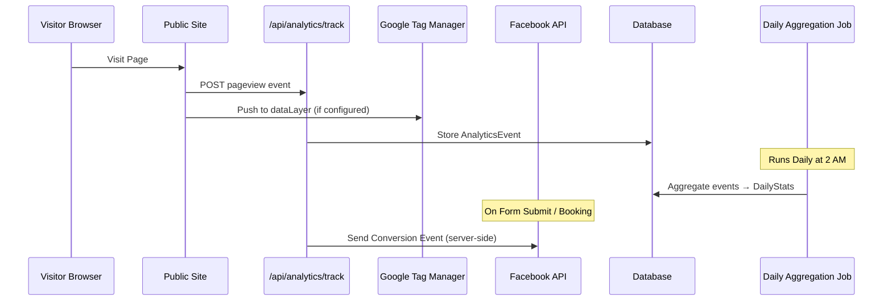

# Analytics & Tracking Architecture

This document outlines the analytics strategy for tracking visitor behavior on public-facing web pages (templates).

---

## Overview

The analytics system uses a **three-tier approach**:

1. **Lightweight Internal Analytics** — Basic dashboard for non-technical users
2. **Google Tag Manager (GTM)** — Advanced tracking for power users
3. **Facebook Conversions API** — Server-side lead tracking

---

## Core Objectives

- Track page views and service popularity
- Measure traffic sources (UTM parameters)
- Provide simple, actionable insights to business owners
- Enable advanced tracking via GTM for technical users
- Track conversions server-side for privacy compliance

---

## Architecture Diagram



---

## 1. Internal Analytics (Lightweight)

### What It Tracks

- **Page Views:** Total visits to each page (Home, Services, About, Contact)
- **Service Performance:** Which service detail pages get the most views
- **UTM Parameters:** Traffic source attribution
- **Basic Session Data:** Unique visitors, sessions

### What It Does NOT Track

- Detailed user behavior (clicks, scrolls) ← Handled by GTM
- Real-time events ← Daily aggregation only
- Complex funnels ← Handled by GA4 via GTM

---

## Data Model

### AnalyticsEvent (Raw Events)

| Field | Type | Description |
|-------|------|-------------|
| `id` | string | Primary key |
| `companyId` | string | FK to Company |
| `type` | string | Event type: `"pageview"` |
| `path` | string | URL path (e.g., `/services/haircut`) |
| `pageType` | string | `"home"`, `"service-detail"`, `"about"`, etc. |
| `serviceId` | string? | FK to Service (if applicable) |
| `utmSource` | string? | UTM source (e.g., `"google"`) |
| `utmMedium` | string? | UTM medium (e.g., `"cpc"`) |
| `utmCampaign` | string? | UTM campaign name |
| `sessionId` | string | Session identifier (cookie-based) |
| `visitorId` | string | Unique visitor ID |
| `timestamp` | datetime | Event timestamp |

**Indexes:**
- `(companyId, timestamp)`
- `(serviceId, timestamp)`

---

### DailyStats (Aggregated)

| Field | Type | Description |
|-------|------|-------------|
| `id` | string | Primary key |
| `companyId` | string | FK to Company |
| `date` | date | Aggregation date |
| `pageViews` | int | Total page views |
| `uniqueVisitors` | int | Unique visitor count |
| `topServices` | json | `[{ id, name, views }]` |
| `topSources` | json | `[{ source, views }]` |

**Unique Constraint:** `(companyId, date)`

---

## 2. Client-Side Tracking

### Tracker Script (Injected into Templates)

A minimal JavaScript snippet is injected into every public page via `TEMPLATE_DATA`:

```javascript
// Injected into <head>
window.EPIKAL_ANALYTICS = {
  companyId: "${company.id}",
  pageType: "service-detail",
  serviceId: "${service.id}", // if applicable
  sessionId: getCookie('epikal_session') || generateSessionId()
};

// Track page view on load
fetch('/api/analytics/track', {
  method: 'POST',
  headers: { 'Content-Type': 'application/json' },
  body: JSON.stringify({
    type: 'pageview',
    ...window.EPIKAL_ANALYTICS,
    path: window.location.pathname,
    utm: extractUTM(window.location.search)
  })
});
```

### UTM Parameter Extraction

```javascript
function extractUTM(search) {
  const params = new URLSearchParams(search);
  return {
    utmSource: params.get('utm_source'),
    utmMedium: params.get('utm_medium'),
    utmCampaign: params.get('utm_campaign'),
    utmContent: params.get('utm_content'),
    utmTerm: params.get('utm_term')
  };
}
```

---

## 3. Google Tag Manager Integration

### Company Configuration

```typescript
model Company {
  gtmContainerId String? // "GTM-XXXXXX"
}
```

### Template Injection

If `company.gtmContainerId` is set, inject GTM container script into `<head>`:

```html
<!-- Google Tag Manager -->
<script>(function(w,d,s,l,i){w[l]=w[l]||[];w[l].push({'gtm.start':
new Date().getTime(),event:'gtm.js'});var f=d.getElementsByTagName(s)[0],
j=d.createElement(s),dl=l!='dataLayer'?'&l='+l:'';j.async=true;j.src=
'https://www.googletagmanager.com/gtm.js?id='+i+dl;f.parentNode.insertBefore(j,f);
})(window,document,'script','dataLayer','${company.gtmContainerId}');</script>
```

### DataLayer Push (Optional)

For enhanced tracking, push structured data:

```javascript
window.dataLayer = window.dataLayer || [];
window.dataLayer.push({
  event: 'page_view',
  page_type: 'service_detail',
  service_id: '${service.id}',
  service_name: '${service.name}'
});
```

**Note:** Users configure their own GTM container with GA4, custom tags, etc. We only inject the container.

---

## 4. Facebook Conversions API (Server-Side)

### Company Configuration

```typescript
model Company {
  fbPixelId      String? // Facebook Pixel ID
  fbAccessToken  String? // Encrypted access token
}
```

### When to Fire Events

- **Lead:** Contact form submission
- **ViewContent:** Service detail page view (optional)
- **Schedule:** Appointment booking

### Implementation

```typescript
async function trackFacebookConversion(event: {
  companyId: string;
  eventName: 'Lead' | 'ViewContent' | 'Schedule';
  userData: { email?: string; phone?: string; ip?: string };
  customData?: { service_id?: string; value?: number };
}) {
  const company = await getCompany(event.companyId);
  if (!company.fbPixelId || !company.fbAccessToken) return;

  await fetch(`https://graph.facebook.com/v18.0/${company.fbPixelId}/events`, {
    method: 'POST',
    headers: { 'Content-Type': 'application/json' },
    body: JSON.stringify({
      data: [{
        event_name: event.eventName,
        event_time: Math.floor(Date.now() / 1000),
        user_data: hashUserData(event.userData), // SHA256
        custom_data: event.customData,
        action_source: 'website'
      }],
      access_token: company.fbAccessToken
    })
  });
}
```

**Privacy:** User data (email, phone) is hashed with SHA256 before sending.

---

## 5. Aggregation Strategy

### Daily Cron Job

Runs at **2:00 AM** daily to aggregate raw events into `DailyStats`.

**Process:**
1. Fetch all `AnalyticsEvent` records for the previous day
2. Group by `companyId`
3. Calculate:
   - Total page views
   - Unique visitors (`COUNT(DISTINCT visitorId)`)
   - Top 5 services by views
   - Top 5 UTM sources
4. Upsert into `DailyStats`
5. (Optional) Delete raw events older than 90 days

**Pseudo-code:**
```typescript
async function aggregateDailyStats(date: Date) {
  const companies = await getAllCompanies();
  
  for (const company of companies) {
    const events = await db.analyticsEvent.findMany({
      where: {
        companyId: company.id,
        timestamp: { gte: startOfDay(date), lt: endOfDay(date) }
      }
    });
    
    const stats = {
      pageViews: events.length,
      uniqueVisitors: new Set(events.map(e => e.visitorId)).size,
      topServices: aggregateTopServices(events),
      topSources: aggregateTopSources(events)
    };
    
    await db.dailyStats.upsert({
      where: { companyId_date: { companyId: company.id, date } },
      create: { companyId: company.id, date, ...stats },
      update: stats
    });
  }
}
```

---

## 6. Dashboard UI

### Analytics Page (`/dashboard/analytics`)

**Overview Cards:**
- Total Visitors (Last 30 days)
- Total Page Views
- Top Service (by views)
- Growth vs. Previous Period

**Top Services Table:**
| Service | Views | Unique Visitors |
|---------|-------|-----------------|
| Haircut | 456   | 320             |
| Massage | 234   | 180             |

**Traffic Sources Chart:**
- Pie chart: UTM Source breakdown
- Table: Source → Views

**Timeline:**
- Line chart: Daily page views over last 30 days

**Call-to-Action:**
> Need more detailed analytics? Configure Google Tag Manager in Settings.

---

## 7. Settings UI

### Analytics Settings (`/dashboard/settings/integrations`)

```
┌─────────────────────────────────────────┐
│ Analytics & Tracking                    │
├─────────────────────────────────────────┤
│                                         │
│ ✅ Basic Analytics (Always On)          │
│    Track page views and service visits  │
│                                         │
│ Google Tag Manager (Optional)           │
│ Container ID: [GTM-______]  [Save]     │
│ ℹ️  For advanced tracking with GA4      │
│                                         │
│ Facebook Conversions API                │
│ Pixel ID:     [__________]             │
│ Access Token: [__________]  [Save]     │
│ ℹ️  Track leads and conversions         │
│                                         │
└─────────────────────────────────────────┘
```

---

## Privacy & Compliance

1. **No PII Storage:** IP addresses are hashed
2. **Cookie Consent:** Session cookie only (no tracking cookies)
3. **Data Retention:** Raw events deleted after 90 days
4. **GDPR Compliance:** Users can request data deletion
5. **Server-Side Tracking:** Facebook Conversions API bypasses client-side blockers

---

## Feature Gating

| Feature | Free | Pro | Enterprise |
|---------|------|-----|------------|
| Basic Analytics | ✅ | ✅ | ✅ |
| GTM Integration | ❌ | ✅ | ✅ |
| FB Conversions API | ❌ | ✅ | ✅ |
| Data Retention | 30 days | 90 days | Unlimited |

---

## Related Documents

- [Templating Engine Architecture](./templating-engine.md) — Public site rendering
- [User, Company & Billing Architecture](./user-company-billing.md) — Company settings
