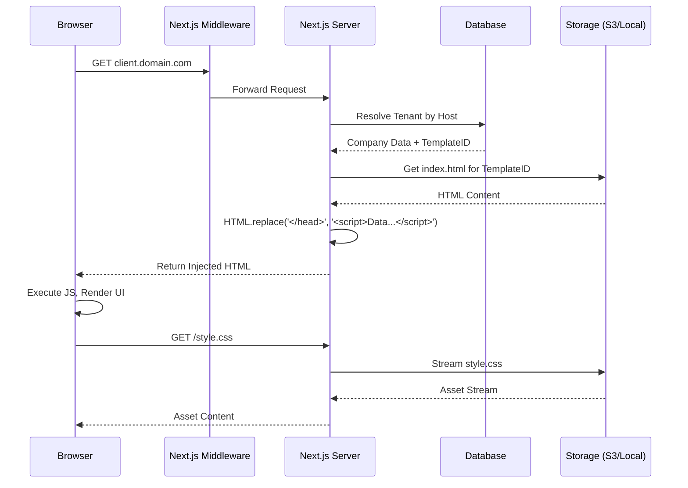

# Templating Engine Architecture

This document describes the architecture for the "Epikal Sites" templating system, which serves public-facing pages (landing pages, portfolios, etc.) based on 11ty-generated templates with dynamic data injection.

---

## High-Level Flow

1.  **Request**: Public user visits `client.epikal.com` (or standard domain with header).
2.  **Resolution**: Server determines the **Tenant** (Company) based on the `Origin` or `Host` header.
3.  **Template Retrieval**: Server identifies the active `Template` for that Tenant.
4.  **Injection**:
    - Server loads the template's `index.html`.
    - Server injects dynamic data (Customer Info, Colors, Branding) into `window.TEMPLATE_DATA` via a `<script>` tag.
5.  **Response**: Browser receives HTML, executes JS, and renders the content.

---

## Core Components

### 1. Template Management (Admin)

**Actors:** Super Admin, Client Admin (upload custom).

- **Input:** ZIP file containing the **build output** of an 11ty project (HTML, CSS, JS, Assets).
    - We assume the template is *already built* into static files.
    - Providing the *source* 11ty code would require a complex server-side build pipeline, which is likely out of scope for "just inject values".
    - *Constraint:* The `index.html` must differ execution until `window.TEMPLATE_DATA` is available.
- **Storage Strategy:**
    - **Production:** S3 Bucket (e.g., `s3://epikal-templates/{templateId}/v{version}/`).
    - **Development:** Local Filesystem (e.g., `tmp/templates/{templateId}/`).
- **Processing:**
    - On upload, the system **unzips** the file to the storage provider.
    - Validates presence of `index.html`.

### 2. The Template Interface

To ensure templates work with our system, they must adhere to a contract:

- **Structure:**
    - `index.html` (Home)
    - `about.html`, `contact.html` (Standard pages)
    - `services/index.html` (Service list)
    - `services/detail.html` (Service detail placeholder)
- **Data Consumption:** Must verify `window.TEMPLATE_DATA` exists.
- **Dynamic Content:**
    - For dynamic pages (like services), the template logic must read `TEMPLATE_DATA.context.slug` or `TEMPLATE_DATA.service` to render the correct content.
- **Assets:** Must use relative paths.

### 3. Rendering Engine (Runtime)

The "Engine" is a Next.js Route Handler or Page that acts as a proxy/injector.

**Route:** `app/(sites)/[[...path]]/page.tsx` (Catch-all for site requests).

**Logic:**
1.  **Tenant Resolution:**
    - Extract `host` header.
    - Resolve Company.
2.  **Path Resolution (Routing):**
    - **Root (`/`):** Serves `index.html`.
    - **Static Page (`/about`):** Checks for `about.html` or `about/index.html`.
    - **Dynamic Page (`/services/my-service`):**
        - If `services/my-service.html` exists → Serve it.
        - Else if `services/_slug.html` (or similar convention) exists → Serve it and inject `slug: "my-service"` into context.
        - Else 404.
3.  **Fetch Data:**
    - Load Company Profile, Branding.
    - **Service Data (Layered):**
        - Fetch base `Service` (Management layer).
        - Fetch `ServiceWebPage` config (Web layer: display title, slug, specific images).
        - **Extensions:**
            - If `schedulingEnabled`, inject booking data.
            - If `agentEnabled`, inject agent config.
            - If `analyticsEnabled`, inject tracking codes.
    - **Plan Features:** Check flags to enable/disable these extensions.
    - **Page Context:** If dynamic route, fetch specific service data.
4.  **Fetch Template File:**
    - Read the resolved HTML file from Storage.
5.  **Injection (Option A):**
    - Search for `</head>`.
    - Insert `<script>window.TEMPLATE_DATA = { ...JSON_PAYLOAD... };</script>`.
6.  **Serve:**
    - Return modified HTML.

### 4. Asset Handling

If `index.html` requests `<link rel="stylesheet" href="./style.css">`:

- The browser requests `client.epikal.com/style.css`.
- Our route handler `[[...path]]` catches this.
- Detects extension is not HTML.
- Proxy finds the asset in Storage (`s3://.../{templateId}/style.css`) and streams it back.
- **Cache-Control:** Set high cache headers for assets.

---

## Data Model Extensions

### Template Entity

```typescript
model Template {
  id          String   @id @default(cuid())
  name        String
  description String?
  
  // Storage reference
  storagePath String   // e.g. "templates/xyz-123/v1"
  
  // Scope
  isPublic    Boolean  @default(true) // Available to all companies?
  companyId   String?  // If uploaded by a specific client
  company     Company? @relation(fields: [companyId], references: [id])
  
  createdAt   DateTime @default(now())
  updatedAt   DateTime @updatedAt
}
```

### Company Extension

```typescript
model Company {
  // ... existing fields
  
  // Site Configuration
  siteTemplateId String?
  siteTemplate   Template? @relation(fields: [siteTemplateId], references: [id])
  
  // Custom Data for the template (JSON)
  siteSettings   Json?     // e.g. { "primaryColor": "#ff0000", "heroImage": "..." }
}

### 5. Template Block Schema (JSON Page Builder)

To support a single `index.html` rendering diverse layouts, we define a standard **Block Schema**. The `TEMPLATE_DATA` will include a `blocks` array.

#### Block Types & Props

| Block Type | Description | Key Props |
| :--- | :--- | :--- |
| `hero` | Main entry banner | `title`, `subtitle`, `image`, `ctaText`, `ctaLink` |
| `features` | Grid of feature cards | `title`, `items: [{ icon, title, description }]` |
| `content` | Rich text section | `htmlContent`, `alignment` (left/center) |
| `testimonials` | Carousel/Grid of reviews | `items: [{ name, role, quote, avatar }]` |
| `faq` | Accordion of questions | `items: [{ question, answer }]` |
| `cta` | Call to action banner | `title`, `text`, `buttonText`, `buttonLink` |
| `contact` | Contact form & info | `email`, `phone`, `address`, `mapEmbedUrl` |

#### Example JSON Structure

```json
{
  "pageTitle": "My Service",
  "blocks": [
    {
      "type": "hero",
      "id": "hero-1",
      "props": {
        "title": "Welcome to ${company.name}",
        "subtitle": "Discover our ${service.count} premium services.",
        "ctaText": "Get Started",
        "ctaLink": "/contact"
      }
    },
    // ...
  ]
}
```

#### Variable Interpolation & Root Entities

Interpolation availability depends on the **Page Context** (Root Entity).

1.  **Home / Static Pages (`/`, `/about`):**
    - **Root Entity:** `Company`
    - **Available Variables:**
        - `${company.name}`, `${company.email}`, `${company.phone}`
        - `${company.address}`, `${company.description}`

2.  **Service Detail Page (`/services/:slug`):**
    - **Root Entity:** `Service` (specific record founded by slug)
    - **Available Variables:**
        - **All Company variables** (global scope)
        - **Service variables:**
            - `${service.name}`
            - `${service.description}`
            - `${service.price}`
            - `${service.duration}`
            - `${service.image}`
            - `${service.extra.*}` (custom fields)

**Note:** If a block uses `${service.price}` on the Home page, it will fail or render empty, unless that specific block is provided with a specific service context explicitly. But generally, blocks inherit the Page's Root Entity.

**Mechanism:**
1.  Backend identifies route type (e.g., Service Detail).
2.  Backend fetches the **Root Entity** (e.g., the Service record).
3.  Backend resolves variables against this entity + Global Company data.
4.  Backend replaces strings in the JSON Blocks.
5.  Injected JSON is sent to client.

### Service Extension (Web Layer)

```typescript
// Extends the base Service entity for web presentation
model ServiceWebPage {
  id          String   @id @default(cuid())
  serviceId   String   @unique
  service     Service  @relation(fields: [serviceId], references: [id])
  
  // Web-specific overrides
  slug        String   @unique
  displayTitle String?
  heroImage   String?
  content     String?  // Rich text description
  
  // Extension Flags
  schedulingEnabled Boolean @default(true)
  agentEnabled      Boolean @default(false)
  analyticsEnabled  Boolean @default(false)
  
  // Module Configs (JSON for flexibility)
  agentConfig       Json?
  bookingConfig     Json?
}
```
```

---

## Architecture Diagram



---

## Key Considerations

- **Security:**
    - `window.TEMPLATE_DATA` must be sanitized? (Actually, since it's JSON injected into script, straightforward `JSON.stringify` is usually safe unless it contains `</script>`. We must escape closing script tags).
    - Custom templates from clients could contain malicious JS.
        - *Risk:* If they perform XSS or steal data.
        - *Mitigation:* Since the domain is the *client's own* (or a subdomain), the risk is mostly to *their* users. We should sanitize sensitive cookies if any (set `HttpOnly`).
- **Performance:**
    - Cache usage is critical.
    - We should cache the `index.html` from S3 in Memory/Redis.
    - We might want to use a CDN in front of Assets.
- **Pre-compilation:**
    - Templates are "pre-compiled" 11ty builds. We do NOT run 11ty on the server.
    - We treat the HTML as "static with holes" (holes filled by client-side JS using `TEMPLATE_DATA`).
- **Feature Flags:**
    - `TEMPLATE_DATA` includes boolean flags (e.g., `features.agentEnabled`).
    - Template JS is responsible for conditionally rendering components (like the Chat Bubble).

---

## Related Documents

- [User, Company & Billing Architecture](./user-company-billing.md) - Users, companies, roles, subscriptions
- [Analytics & Tracking Architecture](./analytics.md) - Page view tracking, GTM, Facebook Conversions API
